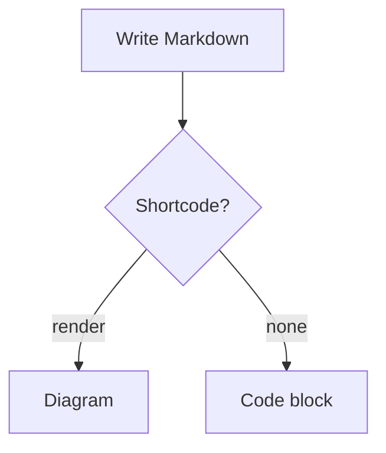

+++
title = "Shortcode: Externals"
date = 2026-04-18
description = "Shortcodes that lean on a bundled external library: Mermaid diagrams and KaTeX math notation."

[taxonomies]
tags = ["shortcode", "syntax", "zola"]

[extra]
series = "Shortcodes"
series_part = 3
+++

Shortcodes for content that needs a library beyond Zola itself. For the ones
that need nothing but the theme, see [Shortcode: Elements](@/posts/shortcode.md)
and [Shortcode: Layouts](@/posts/layout.md).

## Render

`render` renders a fenced `mermaid` or `math` code block as an actual diagram
or formula, instead of a syntax-highlighted code block. Which one runs is
decided by the block's own language, not a separate parameter, so the body
must hold exactly one fenced block, either language.

body
: exactly one fenced code block, language `mermaid` or `math`. Required.

inline
: math only, ignored for mermaid. Renders in the flow of a sentence instead
  of set apart on its own line. Default `false`.

Both libraries ship inside this theme's own `static/` — `mermaid.min.js` and
`katex/katex.min.{js,css}` — the same self-hosted, no-CDN approach as this
theme's fonts and icons. Zola serves a theme's `static/` for any site that
installs it, so nothing extra needs downloading; each is gated behind its own
`[extra]` flag purely to skip the byte cost on sites that use neither.

| flag | turns on |
| --- | --- |
| `enable_mermaid` | `mermaid` blocks — default `true` |
| `enable_math` | `math` blocks — default `true` |

With a flag off, mermaid falls back to a plain code block and math to its
raw, untypeset source — nothing errors, only stays unrendered.

### Mermaid


````md
{​% render() %​}

{​% end %​}
````
```jinja2
{​% import "macros/blocks.html" as blocks %​}
{​{ blocks::render(content="graph TD\n  A --> B", lang="mermaid") }​}
```






Mermaid picks its colour theme once, from the page's `data-theme` at load —
it does not redraw an already-rendered diagram if the visitor flips
light/dark afterwards.

### Math


````md
{​% render() %​}
```math
E = mc^2
```
{​% end %​}
````
```jinja2
{​% import "macros/blocks.html" as blocks %​}
{​{ blocks::render(content="E = mc^2", lang="math") }​}
```



```math
E = mc^2
```


Set `inline=true` to keep it in the flow of a sentence instead of on its own
line:


````md
{​% render(inline=true) %​}
```math
E = mc^2
```
{​% end %​}
````
```jinja2
{​% import "macros/blocks.html" as blocks %​}
{​{ blocks::render(content="E = mc^2", lang="math", inline=true) }​}
```


Einstein's mass–energy equivalence, 
```math
E = mc^2
```
, sits right in the middle of this sentence rather than breaking onto
its own line.


Both flags are independent — a site can turn on one, both, or neither. Each
only loads its own script, so the other's cost is never paid unless its own
flag is on too.

