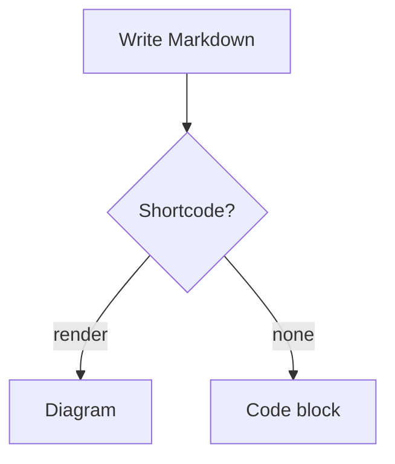

+++
title = "Shortcode: Externals"
date = 2026-04-18
description = "Shortcodes that lean on a bundled external library: Mermaid diagrams and KaTeX math notation."

[taxonomies]
tags = ["shortcode", "syntax", "zola"]

[extra]
series = "Shortcodes"
series_part = 3
+++

## Render

`render` turns one fenced `mermaid` or `math` block into a diagram or formula.
Both libraries ship with the theme and load only on pages that use them.

inline
: math only — render within a sentence. Default `false`.

Needs `enable_mermaid` / `enable_math` (both on by default). With a flag off,
the block shows as plain source.

### Mermaid


````md
{​% render() %​}

```mermaid
graph TD
  A[Write Markdown] --> B{Shortcode?}
  B -->|render| C[Diagram]
  B -->|none| D[Code block]
```
{​% end %​}
````
```jinja2
{​% import "macros/blocks.html" as blocks %​}
{​{ blocks::render(content="graph TD\n  A --> B", lang="mermaid") }​}
```




```mermaid
graph TD
  A[Write Markdown] --> B{Shortcode?}
  B -->|render| C[Diagram]
  B -->|none| D[Code block]
```


### Math


````md
{​% render() %​}
```math
E = mc^2
```
{​% end %​}
````
```jinja2
{​% import "macros/blocks.html" as blocks %​}
{​{ blocks::render(content="E = mc^2", lang="math") }​}
```



```math
E = mc^2
```


Inline:


````md
{​% render(inline=true) %​}
```math
E = mc^2
```
{​% end %​}
````
```jinja2
{​% import "macros/blocks.html" as blocks %​}
{​{ blocks::render(content="E = mc^2", lang="math", inline=true) }​}
```


Einstein's mass–energy equivalence, 
```math
E = mc^2
```
, sits in the middle of this sentence.
